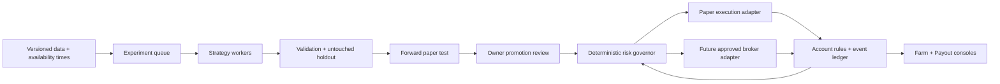

# Prop Farm: Back Office implementation plan

Status: proposed design, 2026-10-02. Branch: `gpt-prop-farm`, based on freshly fetched `origin/trading-office` at `8c7283f`. No trading behavior or account settings are changed by this document.

## Product decision

Make Back Office the research and account-operations floor. Keep Opening Bell as the daily trading workspace. Add a **Prop Farm** console and corresponding wall displays to Back Office instead of constructing another floor. Reuse Strategy Desk, Pine Vault, the existing playbooks, and the newer Back Office consoles after reconciling that branch.

The objective is a repeatable process that can find, reject, forward-test and eventually deploy strategies on eligible accounts. Optimize for **net payouts received, account survival and time/cost to first payout**. Evaluation passes and simulated profit are intermediate metrics, not cash earned.

The first deliverable is a credible local simulator and research dashboard. Automated broker execution is a later, separately enabled capability, after data access, firm permission, reconciliation and operational tests are resolved. No subscription purchase is part of this plan. The rejected $199/month feed is excluded.

## What the reference actually establishes

The five supplied screenshots show an account-management workflow:

| Observed | Design we can reproduce | Still unknown |
| --- | --- | --- |
| Separate evaluation and funded cards, mostly $25K | Multiple independent account instances, grouped by phase | Full history, losing accounts and total acquisition costs |
| A notification for 20 MNQ on an evaluation and another for 5 MNQ funded | Distinct sizing policies by phase | Entry conditions, actual stops, execution quality and permission to automate |
| Passed evaluations displayed separately | Stop routing new trades after a candidate pass; reconcile firm confirmation | Whether every pass meets the applicable consistency and other rules |
| Payout-ready accounts parked until paid | Reserve the account and reconcile the withdrawal before returning it to rotation | Whether funds were actually received |
| Bot notifications with direction, quantity and results | Auditable event notifications backed by a trade ledger | Whether the displayed results represent simulation, broker fills or verified cash |

The payout screenshot mentions **FundedNext**. Its three-day/40%-consistency example must not become a Lucid or Top One rule. The labels “REAL” and “LIVE” are claims in the reference, not independently verified results. Identical results on copied accounts are one correlated trading event, not independent evidence of a strategy edge.

Instagram research: after the owner signed in, two relevant reels were inspected:

- [Backtesting walkthrough, Part 1](https://www.instagram.com/oceanfront.ai/reel/Dd8VTqIRdGZ/): the visible video presents a claim of testing 10,000 strategies, with a spreadsheet and a grid of charts. Its post caption promotes mentorship; it does not supply the strategy specification or test methodology.
- [Account notification example](https://www.instagram.com/not.a.lil.fish/reel/Dd7mrBgNstA/): the visible overlay shows filled and closed notifications for five MNQ on one funded-labeled account. This reinforces the trade-event/notification workflow, not the profitability or provenance of the fills.

**No reliable spoken transcript was obtained.** The video player exposed no caption tracks; media export timed out and the loaded audio asset export failed. Do not treat the promotional caption or a few visible frames as a transcript. A supplied video file or accessible transcript would allow a timestamped analysis of the spoken explanation. The design below is based on the supplied screenshots, these limited reel observations, existing code and official rules; it does not claim to recover the creator's hidden entry strategy.

## Existing code: reuse and repair

| Component | Verified state | Plan |
| --- | --- | --- |
| `trading-office` at `8c7283f` | Strategy Desk, versioned Pine Vault, minute-bar paper engine, parameter testing and account presets | Keep as the starting branch |
| Local `backoffice-consoles` at `2ebebaa` | Contains `trading-office` plus Claude's Backtest Lab, evaluation simulator, game plans, trade management, tuner and a single forward paper evaluation | Review and integrate this work before replacing overlapping modules; remote branch is older (`6d2e1fc`) |
| `src/server/trading/pine-sim.ts` | Checks target before stop when both occur within one bar; gross results | Separate Pine-behavior parity from realistic fills; disclose ambiguous bars and add execution costs |
| `src/server/trading/engine.ts` | Checks stop first; gross results | Use a shared documented fill policy and event clock across engines |
| `src/server/trading/lab.ts`, newer `tuner.ts` | Uses later days to compare/select variants | Those later days are validation data; reserve a new untouched final holdout and forward stream |
| `src/server/trading/desk.ts::simulateEval` | Simplified closed-trade accounting and pass logic | Replace promotion evidence with event-level account simulation |
| Newer `shared/evalsim.ts` | Adds consistency, risk settings and resampling, but operates on closed trade results | Extend to intratrade equity, overlapping positions, fees, payouts and phase-specific rules |
| Newer `server/trading/live-eval.ts` | One configuration replaying paper results, optionally including past days | Support many pinned runs; distinguish retrospective replay from genuinely forward-recorded decisions |
| `PROP_ACCOUNTS` and newer `prop-catalog.ts` | Inspected versions have no 25K entries; some guessed/stale limits | Introduce verified 25K/50K templates and multiple instances of each template |
| Market data | Delayed futures fallback; TradingView bar-close overlay; TopstepX connector | Track freshness, gaps, exact contracts and provenance. Tradovate/Rithmic integration remains unverified |

These findings are code inspection, not a completed correctness audit. Existing tests passing would not establish financial accuracy.

## Firm rules change the design

Rules checked against official pages on 2026-10-02. The actual purchased program, cohort, optional settings and platform must be recorded; do not silently update an existing account when a website changes.

| Program | 25K evaluation | 50K evaluation | Automation |
| --- | --- | --- | --- |
| LucidFlex | $1,250 target; $1,000 max-loss allowance; 20-micro ceiling | $3,000 target; $2,000 max-loss allowance; 40-micro ceiling | Lucid permits automated strategies subject to its rules; API access still needs verification |
| Top One Elite / Elite ACCESS | 10-micro evaluation ceiling | 30-micro evaluation ceiling | Current general rules prohibit bots/automated execution; keep manual assistance only |

Sources: [LucidFlex evaluation](https://support.lucidtrading.com/en/articles/12945790-lucidflex-evaluation-account), [Lucid permitted activities](https://support.lucidtrading.com/en/articles/11404728-other-trading-activities), [Top One position limits](https://help.toponefutures.com/en/articles/10906950-maximum-contracts-explained), [Top One prohibited practices](https://help.toponefutures.com/en/articles/11021584-prohibited-trading-practices).

LucidFlex funded limits start below the overall maximum: 25K begins at 10 micros and 50K at 20, with tiers updated at session end. A payout can lower the tier. Its evaluation consistency rule is separate from funded payout conditions. The drawdown documentation also specifies a payout-triggered threshold adjustment. These must be modeled as distinct rules and events, not a single generic profit target. Sources: [scaling](https://support.lucidtrading.com/en/articles/12945808-lucidflex-scaling-plan), [drawdown](https://support.lucidtrading.com/en/articles/12945815-lucidflex-drawdown), [funded account](https://support.lucidtrading.com/en/articles/12945795-lucidflex-funded-account), [payouts](https://support.lucidtrading.com/en/articles/12945796-lucidflex-payouts).

Top One also disallows intentional evaluation churning. Account rotation here means managing eligible owned accounts and protecting pending payouts; it does not mean repeatedly sacrificing accounts to chase one passing result. Account/household limits, copying restrictions and prohibited cross-account hedging are part of account eligibility. Unknown rules prevent a verified pass or automated promotion; hypothetical overrides remain available only as clearly labeled research scenarios.

## Risk experiments: 25K and 50K are first-class

Treat requested **3–5 funded / up to 20 evaluation contracts as micros and experimental upper bounds**, not mandatory order sizes. Keep evaluation and funded policies separate. A larger evaluation limit is useful only if it improves the distribution of outcomes after failure costs and consistency rules.

For MNQ, each index point is $2 per micro ([CME contract specification](https://www.cmegroup.com/markets/equities/nasdaq/micro-e-mini-nasdaq-100.html)). Illustrative loss at the stop, before fees and slippage:

| Micros | 10-point stop | 20-point stop |
| --- | ---: | ---: |
| 3 | $60 | $120 |
| 5 | $100 | $200 |
| 10 | $200 | $400 |
| 20 | $400 | $800 |

Thus 20 MNQ with a 20-point stop consumes $800 of a fresh $1,000 loss allowance before costs. It is a stress scenario, not a default for a 25K account. Do not tighten a strategy's natural stop merely to fit a preferred quantity.

Quantity is the minimum of the requested cap, the firm's current remaining limit, and the quantity supported by the remaining dollar-risk budgets. Per-contract risk includes stop distance times point value, estimated round-trip fees and adverse execution allowance. Available budgets subtract open and pending-order risk, a drawdown reserve, daily loss already incurred and portfolio exposure. If one micro cannot fit, skip with an explanation. Limits are instrument-specific; a conversion suitable for MNQ is not a universal micro rule.

Research matrix:

- Account: LucidFlex 25K and 50K first; Top One 25K/50K manual-assistance simulations after its exact program rules are captured.
- Phase: evaluation, sim-funded and real-funded as distinct execution environments.
- Sizing: cushion-based baseline; funded caps 3 and 5; evaluation caps 5, 10, 15 and 20 where allowed. An illegal combination is rejected before a run.
- Strategy: current VWAP Double Break and Failed Auction baselines; then ORB retest, trend pullback and value-area rejection as explicitly specified candidates, not claimed edges.
- Costs: current broker/firm fees, multiple slippage assumptions, missing bars, delayed signals and restart/disconnection scenarios.
- Outcomes: pass before breach, first payout before breach, days to first payout, remaining cushion after payout, worst loss cluster, net cash after all account fees, plus uncertainty and sample size.

## The Back Office experience

**Farm Overview:** 25K/50K filters; evaluations, sim-funded, real-funded, parked and breached states; connected/manual/simulated source badges. Each card shows current balance, *distance to failure*, today's loss budget, allowed micros, pinned strategy version and the reason it is active or paused. Totals distinguish simulated profit, estimated payout eligibility, requested payouts and confirmed cash received.

**Research Queue:** each agent's hypothesis, dataset, job stage, progress, artifacts, compute budget and a stop button. Finished jobs include failed and inconclusive experiments, not only winners.

**Strategy Comparison:** baseline versus candidate on the same days and costs. Show training, validation, final holdout and forward evidence separately. Drill into every entry, rejection and fill. Rank by robustness and account outcomes; show a trade-off chart of time-to-payout versus breach probability rather than a single “best bot” score.

**Forward Test:** decisions recorded before outcomes arrive, with market timestamps, signal latency and simulated fill assumptions. Delayed data is labeled “delayed forward replay,” never exchange-live testing. Every account can explain “why this quantity?” and “why no trade?”

**Payout Desk:** rule checklist, eligible amount versus requested amount, pending confirmation, post-withdrawal floor and next eligible trading time. Accounts parked pending payout cannot receive new simulated allocations or future live orders. Re-entry requires a reconciled withdrawal and a fresh risk calculation.

Walk-up screens open these consoles, and a keyboard shortcut opens the same view. Keep the current preferred room and desk presentation. No new 3D floor is necessary for version one.

## Agent responsibilities and strategy families

| Role | Work product | Boundary |
| --- | --- | --- |
| Research lead | Falsifiable hypothesis, bounded candidate set and predeclared evaluation criteria | Cannot change broker settings or promote its own strategy |
| Strategy workers | Separate jobs for VWAP/ORB, Failed Auction, sizing and account-rule experiments | Run reproducible code against pinned data; no credentials |
| Skeptic / validation worker | Leakage checks, cost stress, regime breakdown, negative results | Uses locked evaluation slices; reports disagreements |
| Risk governor | Quantity, exposure and eligibility decisions with reason codes | Deterministic service; every strategy goes through it |
| Account accountant | Reconciled balances, payouts, fees, floors and rotation eligibility | Deterministic ledger; cannot infer a payout from a winning notification |
| Operations observer | Feed/reconnect health, missed events and job limits | Pauses new work on unresolved state; never silently retries an unknown order |

These are proposed product roles, not agents launched by this planning task. Start with one CPU-heavy simulation worker, bounded batches and pause/resume. LLMs review runs and propose experiments; they need not run on every tick. Reuse the desk's provider selection for research workers. Keep all provider/job costs visible. Additional concurrency is configurable after measuring CPU use, given the earlier overheating concern.

**Deterministic lane:** exact entry, stop, target, session and invalidation rules; identical inputs yield identical decisions. Deploy this lane first after evidence and execution readiness checks.

**Adaptive lane:** an agent or statistical model selects among approved playbooks, classifies a regime or abstains. It returns a constrained decision with provenance. Store features, their availability times, model/prompt/version, response, seed when available and output validation. Model errors, timeouts or contradictory outputs mean abstain. It cannot alter hard risk limits. Replay saved decisions; do not re-query today's model about historical candles and call that a historical live test. Run shadow-only until it demonstrates incremental value over the deterministic baseline.

Randomized parameter search is a research method, not evidence that random trade decisions work. A nondeterministic model still needs a deterministic risk and execution boundary.

## Architecture and account lifecycle

Core records:

- `RuleSet`: firm, program, size, phase, purchase cohort, effective/verified dates, official sources, drawdown basis/timing, consistency, scaling, news/session/inactivity restrictions, payout rules, contract units and automation capability. Unknown differs from unlimited.
- `AccountInstance`: unique account ID separate from template ID; execution environment; opening balance, settled balance, unrealized equity, peak, floor, fees, payouts and assigned strategy/risk policy versions. Five copies of one template remain five independent ledgers.
- `StrategyVersion` / `ExperimentRun`: immutable source/parameter hashes, parent, dataset hash, timeframe/session, observed contract and roll policy, costs/fill assumptions, split IDs, search count, compute cost and full results.
- `DecisionEvent` / `TradeEvent` / `PayoutEvent`: source event time and receipt time, idempotency key, reason, actual versus simulated status, account and strategy attribution. Keep an append-only audit trail and rebuildable snapshots.
- `ForwardRun`: pinned deployment start, strategy/rule/data versions, lane and account allocation. New parameters create a new run; they cannot rewrite the past.

Account states: research-only → evaluation active → target reached / rules pending → pass pending firm confirmation → evaluation passed → linked sim-funded instance → active → payout eligible → payout requested / parked → withdrawal reconciled → active. Breached, disconnected, review-required and retired states can interrupt the flow. Real-funded is a separately confirmed environment. Internal simulation results never relabel an actual firm account as passed or paid.

## Evidence before promotion

1. **Data:** exact contract, session calendar, timestamps, completeness, source and rights recorded; no blending continuous-adjusted prices, micros/minis or providers without explicit mapping. Cache history and backfill gaps. Retain delayed data for research with honest labels.
2. **Simulation:** correct signal availability time; realistic next-executable fills; adverse gap fills; fees; same-bar ambiguity policy; intratrade equity and overlapping exposure. Minute bars cannot establish tick order or exact sub-minute rule compliance. Show uncertainty instead of inventing precision.
3. **Selection:** rolling train/validation windows and a quarantined final holdout. Track every variant attempted. Do not call a repeatedly consulted validation period out-of-sample proof. Block-bootstrap whole days or sessions to preserve dependence; copied account trades count once when assessing edge. Monte Carlo estimates are conditional scenarios, not promised pass probabilities.
4. **Forward evidence:** pinned strategies generating timestamped decisions before outcomes, compared against the baseline using identical costs and account rules. A prospective release gate can start at at least 30 trading sessions and 100 independent closed trades, plus positive cost-stressed holdout results and no unresolved correctness issues; these are planning thresholds, not a guarantee or sufficient proof on their own. Low-frequency strategies may need much longer.
5. **Execution readiness:** verified firm/platform eligibility; supported data and execution credentials; broker reconciliation; idempotency; partial-fill and rejection handling; bracket-order confirmation; restart recovery; fresh account/market state; a tested owner-controlled stop. A timed-out order is reconciled before retry. Test on a sandbox first and enable any actual trading through a separate owner action after review.

A research candidate cannot change the running strategy automatically. Losing the feed or reconciling an unknown account state blocks new exposure. Existing positions follow a tested broker-native protection and recovery policy; a dashboard disconnect must not remove a stop. Payouts, purchases and resets remain owner actions.

## Ordered implementation slices

Each slice should remain reviewable on its own and touch roughly 2–5 files. Paths named as new modules are proposals. Resolve the Back Office integration before implementing overlapping features.

### 0. Reconcile the existing Back Office
Dependency: none. Scope: integration, split by existing feature commits if needed.
- Acceptance: preserve Strategy Desk and current preferred presentation while incorporating reviewed Back Office consoles; record the actual integrated commit; preserve all other worktrees.
- Verification: current tests, typecheck, build, then focused Back Office and Strategy Desk browser checks. Resolve failures before new farm work.

### 1. Versioned rules and 25K/50K account instances
Dependency: 0. Files: `shared/prop-rules.ts`, `shared/prop-catalog.ts`, `shared/trading.ts`, `server/trading/accounts.ts`, rules tests.
- Acceptance: separate template and account identity; verified LucidFlex 25K/50K eval/funded templates; multiple instances; purchase-specific optional DLL and rule provenance.
- Verification: boundary fixtures for caps, drawdown locks, funded scaling and payout-triggered adjustments; migration preserves existing balances.

### 2. Comparable fills and costs
Dependency: 0. Files: new `shared/fills.ts`, `server/trading/engine.ts`, `server/trading/pine-sim.ts`, fill tests.
- Acceptance: shared realistic policy alongside explicitly labeled Pine parity; commission and slippage; timestamps reflect when a completed bar can be acted upon.
- Verification: same-bar stop/target, gaps through stops, missing bars, delayed receipt and long/short arithmetic fixtures.

### 3. Account event replay
Dependency: 1–2. Files: `shared/evalsim.ts`, new `shared/account-ledger.ts`, account tests.
- Acceptance: evaluate chronological position/equity events, daily and trailing limits, consistency, sessions with no trades and concurrent exposure; distinguish insufficient data from pass.
- Verification: hand-calculated 25K/50K ledgers, intratrade breach before a later recovery, overlapping trades and exact threshold cases.

Checkpoint A: account and fill math reconciles against hand-worked examples; existing tests/typecheck/build pass.

### 4. Evaluation versus funded sizing experiments
Dependency: 3. Files: `shared/risk-policy.ts`, `shared/evalsim.ts`, `client/trading/evalsim.ts`, risk tests.
- Acceptance: requested caps and computed allowed size both visible; per-phase settings and dollar-risk explanations; illegal requests rejected rather than silently treated as valid experiments.
- Verification: reproduce the MNQ risk table, zero-size skips, falling cushion, pending orders and portfolio limits.

### 5. Durable experiment jobs
Dependency: 2–4. Files: `server/trading/jobs.ts`, `server/trading/lab.ts`, `server/trading/tuner.ts`, job tests.
- Acceptance: bounded jobs, cached dataset hashes, reproducible seeds, full failed-result retention, cancel/resume and one simulation worker by default.
- Verification: restart during work, duplicate submission, cancellation and CPU/concurrency limits.

### 6. Honest strategy selection
Dependency: 5. Files: `server/trading/validation.ts`, `server/trading/lab.ts`, `server/trading/tuner.ts`, validation tests.
- Acceptance: training/validation/locked-holdout split; search count; cost stress and block-resampled account outcomes; frozen promotion evidence.
- Verification: deliberately overfit candidate fails untouched data; shuffled/leaky fixture detected; identical data/config produces identical report.

### 7. Farm Overview and research controls
Dependency: 1, 4–6. Files: new `client/trading/farm.ts`, `client/trading/backoffice-boards.ts`, `client/trading/feed.ts`, `server/server.ts`, `client/trading/lab.css`.
- Acceptance: walk-up and shortcut open the same console; 25K/50K account cards and jobs show source, risk, stage and pause reason; no fabricated live balances.
- Verification: screenshot and keyboard/modal checks; job progress/cancel flow; account totals match ledger fixtures.

Checkpoint B: owner can launch a bounded experiment and inspect strategy and account outcomes end-to-end.

### 8. Multiple forward paper runs
Dependency: 3, 6–7. Files: `server/trading/live-eval.ts`, new `server/trading/forward.ts`, `client/trading/farm.ts`, forward tests.
- Acceptance: pinned versions and real start timestamps; shared decisions with separate account ledgers; delayed feed clearly distinguished from live paper testing.
- Verification: restart without duplicate trades, no retrospective decision rewriting, stale-feed pause and comparison against recorded market events.

### 9. Payout ledger and account rotation
Dependency: 3, 7–8. Files: `server/trading/payouts.ts`, `server/trading/accounts.ts`, `client/trading/farm.ts`, payout tests.
- Acceptance: eligibility/request/received distinctions, parked account enforcement and post-withdrawal sizing; fees and actual cash separated from simulated P&L.
- Verification: duplicate withdrawal, denied request, partial payment, account restart and forbidden cross-account exposure fixtures.

### 10. Adaptive agent shadow lane
Dependency: 5–8. Files: `server/trading/research-agent.ts`, `shared/research-decision.ts`, `client/trading/farm.ts`, adapter tests.
- Acceptance: bounded structured proposals and abstention; frozen evidence and model provenance; baseline comparison; risk limits cannot be overridden.
- Verification: malformed response, unavailable model, late output and adversarial input fail closed; replay uses the recorded response.

### 11. Broker feasibility and sandbox adapter
Dependency: can investigate access now; execution implementation depends on Checkpoint B and a supported account.
Files: new `server/trading/broker.ts`, one provider adapter, `client/trading/panel.ts`, sandbox tests.
- Acceptance: explicit provider capabilities and data permissions; read-only reconciliation first; approved API sandbox validates order lifecycle independently of research agents.
- Verification: partial fill, reject, timeout, reconnect, duplicate event, missing bracket and stale account-state scenarios. New exposure remains disabled if firm/API support is absent.

Checkpoint C: review forward evidence, rule eligibility, operational recovery and actual expected costs. Any real-money activation is a separate owner-controlled deployment decision; this plan does not activate it.

## First useful milestone and remaining unknowns

Build slices 0–4 first: retain Claude's Back Office, add correct 25K/50K accounts, fix execution assumptions and compare the requested evaluation/funded risk caps. This yields useful research while data-access choices remain unresolved. Then add the durable agent queue, forward runs and payout rotation.

Open items: exact reference reel transcripts; chosen Lucid/Top One programs and purchase options; current platform API rights and costs; budget for permitted historical data; exact entry/exit strategy definitions; broker fees and actual account state. The user currently has paid TradingView/CME access and no active prop account. This plan does not assume that chart access grants external API rights or that a future prop account automatically solves data access.

Do not use a claimed one-trade pass, a high win rate, or an AI-written explanation as promotion evidence. The useful result is an inspectable system that says which strategies survive realistic costs and account rules—and explains why the rest were rejected.
